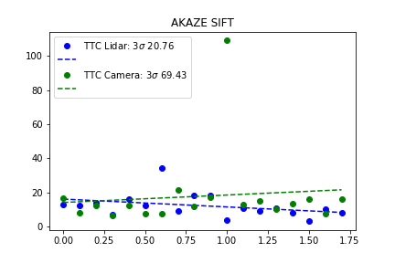

# SFND Project 3, Camera/Lidar Fusion

## FP.1 Match 3D Objects

Function to match the bounding boxes is implemented in camera_fusion_student.cpp around line 289. The approach is to loop through each pair of bounding boxes (with and inner and outer loop), and for each pair track how keypoint matches between the two images are within both bounding boxes. Whichever pair of bounding boxes has most matches is called the best match, with a low cutoff of 5 matches.

## FP.2 Compute Lidar Based TTC

Function to compute lidar based TTC is located in camera_fusion_student.cpp around line 222. The approach is look at all the x distances between ego car and front car, and try to filter by both low reflectivity, and having a x which is far outside of the distribution of x values across all the points. Then the mean of all the distances from ego car are computed in both images, and then the TTC is computed under the constant velocity assumption using the distances and the frame rate.

## FP.3 & FP.4 Compute Camera TTC

Function to compute camera based TTC is located in camera_fusion_student.cpp around line 135 and 156. First the function clusterKptMatchesWithROI keeps only those points within the bounding boxes. Second, all the distance ratio matches are computed. Then again, poor matches are filtered if their predictions of distance to ego car is well outside of the distribution of values of other points (in the function computeTTCCamera).

## FP.5 Lidar Analysis

Form the topview images, it is clear that the overall trend is that car directly in front is slowly getting closer to the ego car. There are clearly no abrupt jumps in the distance between this car and the ego car, yet the TTC Lidar shows two pretty dramatic jumps. One is around frame 6/7 and 7/8 pairs, where is goes form around 15 to around 35 s, the second is around 10/11 and 11/12, where it drops to around 3 s. From the top and the back view images, it appears that this is related to entire rows of pixels moving up and down the back of the car. In the images, I can see lines of lidar pixels which start right on the bottom bumper of the car. In some frames, the lidar is hitting this surface and giving good reflections, in others it is being filtered.

## FP.6 Camera Based TTC Analysis

See below for a comparison of different descriptor and detector pairs. All possible combinations can be loaded with analysis.ipynb, and all the plots are saved as images in the summary directory. Overall, the trend and variation of the camera based TTCs is pretty similar to the lidar based ones, however with some pairs showing really huge outliers. For example, the ORB_BRIEF combo has a 180s estimate, obviously wrong. Overall I do not see clear trends in matchings, other than the SHITOMASI seem to perform poorly in general, with several combos showing very large outliers. This would suggest to me to keep using the FAST detector (since as advertised it is fast!), with one of the modern descriptor types (one which is not patented), perhaps with a bit of additional filtering.

Overall, I think that taking advantage of the time series data would be beneficial here, perhaps taking a 1D smoothing based on time might help improve the reliability also, especially if the lidar and ttc estimates were properly combine, since it seems that by looking at both together, combine with the fact that it should be consistent with history of past measurements would be a good next step.

### Series of Different Descriptors

### Series of Different Detectors

